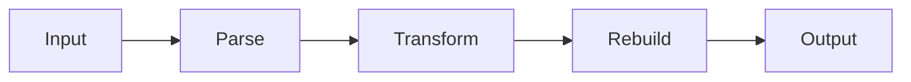

# script-optimizer 🗜️⚡

  

*Your bloated JS, CSS, and HTML walk in fat — they walk out fighting weight.*

## 🎯 What this is NOT

This is not another half-baked online textbox that chokes on a 200KB file and begs you to "upgrade to Pro." It's not a wrapper around three regex replacements pretending to be a compiler. And it's definitely not a tool that phones home with your source code to "improve our AI models."

**What it actually is:** a standalone Windows desktop application that takes your JavaScript, CSS, and HTML and surgically removes everything that isn't load-bearing — whitespace, dead comments, redundant tokens, verbose variable names — while leaving your logic completely intact. `script-optimizer` was built by someone who got tired of shipping 4MB bundles to production and watching Lighthouse scores cry.

It exists for the frontend engineer who cares about payload size, the indie game dev shipping a browser build, the agency dev who inherited a codebase written by someone who never met a line break they didn't love, and the build-pipeline tinkerer who wants a minifier that doesn't require Node, npm, or a prayer to the dependency gods. If you've ever stared at a `main.bundle.js` and thought "this is 60% air," this tool is for you.

> [!NOTE]
> `script-optimizer` runs entirely offline. No file you feed it ever leaves your machine. Minification happens locally, in-memory, and the output is written straight back to disk.

  

---

## 🔥 The Toolbox That Actually Ships

- **Multi-language squeeze** — JavaScript, CSS, and HTML all go through dedicated parsers, not one lazy generic regex trying to do everyone's job at once.

- **Whitespace annihilation** — tabs, trailing spaces, and pointless blank lines get evicted without mercy, and your code compression ratio actually shows it.

- **Comment stripping with brains** — it knows the difference between a dead `// TODO: fix this later (2019)` and a legally-required license header, and keeps the one that matters.

- **Variable shortening (JS)** — local variable and function-scope identifiers get renamed to short, collision-free tokens, shrinking output without touching your public API surface.

- **CSS rule folding** — duplicate selectors get merged, shorthand properties get preferred, and your stylesheet stops looking like a novel.

- **HTML attribute tidy-up** — quote normalization, void-element cleanup, and optional-tag omission where the spec actually allows it.

- **Batch mode** — drag in a whole `/dist` folder, not just one file. It chews through hundreds of assets in one pass.

- **Source map generation** — because minified code shouldn't mean unreadable stack traces in production forever.

> [!TIP]
> Pair batch mode with the "mirror output folder" setting so your minified files land in a clean `/build` directory instead of overwriting originals. Sanity preserved.

---

## 🚀 Getting Off the Ground

1. Hit the download button above — it drops you on the official landing page, not some sketchy mirror.

2. Grab the latest Windows build (single `.exe`, no installer wizard nagging you about toolbars).

3. Launch it, drag your `.js`, `.css`, or `.html` file (or a whole folder) onto the window.

4. Click **Optimize**, watch the byte counter drop, and export.

That's it. No config file to write before your first run, though power users can absolutely go deeper — see the UI section below.

---

## 💻 System Requirements

| Component | Requirement |
|---|---|
| OS | Windows 10 (64-bit) or Windows 11 |
| RAM | 4GB minimum, 8GB recommended for large batch jobs |
| Disk | ~45MB install footprint |
| Dependencies | None — fully self-contained, no runtime installs needed |
| Internet | Not required after download |

> [!IMPORTANT]
> This is a Windows-native build. There is currently no macOS or Linux release — running it under Wine or a compatibility layer is unsupported and results may vary wildly.

---

## 🧠 How It Works

The pipeline is deliberately simple, because minification tools that get clever with your syntax tree tend to also get clever with breaking your code.

1. **Ingest** — file(s) are read and language-detected by extension and content sniffing.

2. **Parse** — each language gets tokenized by its own dedicated lexer (no shared "universal" parser nonsense).

3. **Transform** — dead weight is identified: comments, whitespace, verbose identifiers, redundant syntax.

4. **Rebuild** — a compact, semantically-identical output is reassembled token by token.

5. **Verify** — an internal syntax check confirms the output still parses cleanly before it's ever written to disk.

---

## 🛟 Troubleshooting

<strong>My minified JS throws a syntax error the original didn't have.</strong>

This usually means you're using a very new or very unusual language feature the parser doesn't recognize yet. File an issue with a minimal reproduction — these get prioritized fast.

<strong>The output file is barely smaller than the input.</strong>

Check if your source was already minified (some bundlers pre-compress). Also verify "Aggressive Mode" is enabled in Settings — the default profile is intentionally conservative for safety.

<strong>Source maps aren't generating.</strong>

Source map output is off by default to keep exports fast. Toggle it under **Settings → Output → Generate Source Maps** before running the job.

<strong>Batch mode skipped some files in my folder.</strong>

Files with unrecognized extensions are silently skipped rather than crashing the batch. Check the log panel — it lists every skipped file and why.

<strong>Windows Defender flagged the download.</strong>

Unsigned indie executables often trigger heuristic warnings. The binary is clean; this is a known false-positive pattern for new, low-download-count apps. Verify checksums on the landing page if you want extra assurance.

---

## 🎨 UI, UX & the Little Things

`script-optimizer` ships with a dark-first interface because nobody wants to minify code at 1am under a floodlight.

- **Themes** — Dark (default), Light, and "High Contrast" for accessibility.
- **Keyboard shortcuts:**

| Action | Shortcut |
|---|---|
| Open file | `Ctrl + O` |
| Run optimization | `Ctrl + Enter` |
| Batch mode | `Ctrl + B` |
| Toggle diff view | `Ctrl + D` |
| Settings panel | `Ctrl + ,` |

- **Live diff view** shows before/after side-by-side with byte-count deltas, so you can actually *see* the win.
- **Per-project presets** — save your minification profile (aggressive vs. conservative, comment policy, renaming rules) per project so you're not reconfiguring every session.

> [!WARNING]
> Aggressive Mode on JS can rename variables referenced dynamically via string lookups (`window["myVar"]`). If your code does this, stick to Conservative Mode or explicitly whitelist those names in Settings.

---

## 🤝 Contributing & Community

`script-optimizer` grew from a personal side project into something with real users, and it stays that way because people actually show up.

- Found a bug? Open an issue with a repro file — vague reports get vague answers.
- Got a parser edge case fixed? PRs are genuinely welcome, tests included please.
- Want to discuss architecture, roadmap, or why we still haven't shipped a Linux build? Discussions tab is open.

  

> Every accepted PR earns you a permanent line in the changelog. It's not much, but it's honest recognition.

---

## 📜 License

Released under the [MIT License](LICENSE), 2026. Use it, ship it, embed it in your own build pipeline — just don't remove the attribution.

---

## ⚠️ Disclaimer

`script-optimizer` is provided as-is, without warranty of any kind. While the syntax verification step catches most issues before output, you are responsible for testing minified code in your own environment before deploying to production. The maintainers are not liable for broken builds, missed deadlines, or existential crises caused by discovering how much dead code was in your bundle.

---

  

